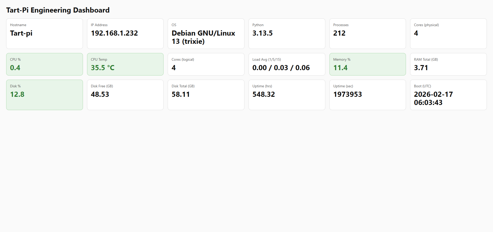
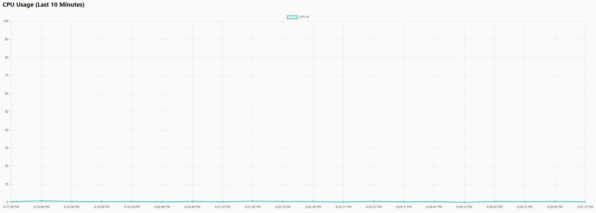
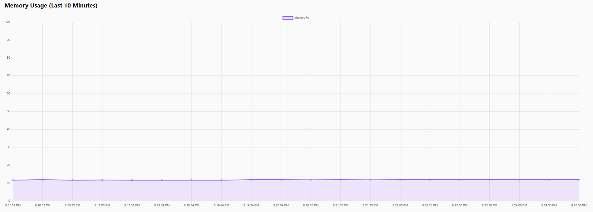
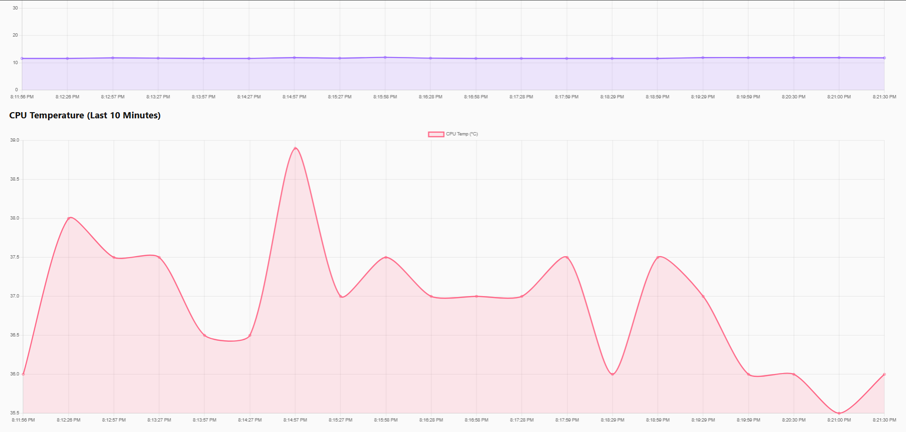

# Tart-Pi Engineering Dashboard

A Raspberry Pi–based system monitoring platform designed to explore embedded systems, backend services, and infrastructure engineering.

## Dashboard

The monitoring dashboard displays live telemetry collected from the Raspberry Pi in real time.

## Dashboard

### System Overview

### CPU Usage Monitoring

### Memory Usage Monitoring

### CPU Temperature Monitoring

## Overview

This project runs a persistent monitoring service on a Raspberry Pi that collects and logs system telemetry including:

- CPU utilization
- CPU temperature
- Memory usage
- Disk usage
- System load averages
- Uptime
- Process count

Metrics are sampled every 5 seconds and stored in a SQLite time-series database.

## Architecture

Raspberry Pi (Debian Linux)

FastAPI Backend  
Background Telemetry Worker  
SQLite Time-Series Database  
REST API Endpoints  
Web Dashboard  

## API Endpoints

`/metrics`
Returns current system metrics.

`/metrics/history`
Returns historical metrics with optional downsampling.

`/dashboard`
Web dashboard displaying system telemetry.

## Deployment

The service runs as a persistent Linux service using **systemd** and automatically starts on boot.

## Technologies

Python  
FastAPI  
SQLite  
systemd  
Linux (Debian on ARM)
